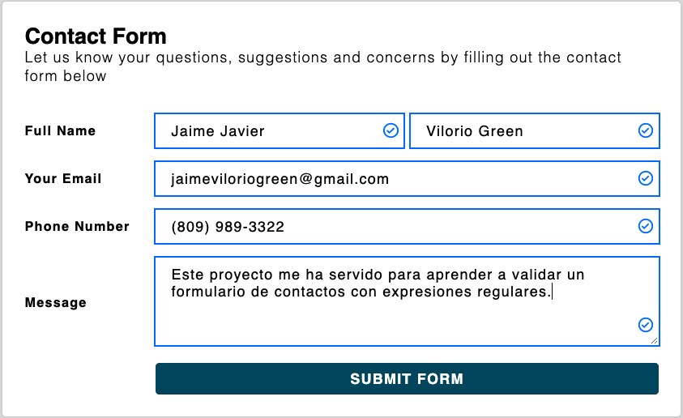

# Validar un Fomulario

Este proyecto tiene como finalidad validar un formulario utilizando, principalmente, expresiones regulares, utilizando estás tecnologías:

- CSS:
  - Flexbox
  - Grid
  - Positions
  - Coustom Properties
- JavaScript
  - Módulos
  - Clases
  - Getters & Setters
  - Expresiones Regulares

### Consideraci0nes
1. La validación del los campos tipo text exige un mínimo de dos caracteres de palabra.
2. El campo tipo textarea, también exige un mínimo de dos caracteres de palabra y los siguientes caracteres: ==.:;¡!¿?()==.
3. El campo asignado para validar el teléfono, solo aplica para el código de área de mi país (República Dominicana), los cuales son: ==809, 829 y 849==.

